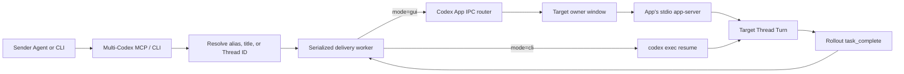

# Architecture and verification contract

## Goal

Push a normal user prompt from one Codex conversation into another existing Thread. The receiving
Agent starts automatically and does not poll a bridge inbox. When the target is open in a Codex App
window, that window must render the prompt, streaming state, and response without an App restart.

## Delivery paths



### GUI path

Codex App starts one local app-server over anonymous stdio and registers each renderer window with
its local IPC router. Multi-Codex connects to the existing router Socket and sends the App's
`thread-follower-start-turn` request. The router selects the renderer that owns the target Thread.
That owner starts the Turn through the App's existing app-server connection, so all normal events
reach the already-open target window.

The request uses protocol version 1 and nests app-server parameters under `turnStartParams`. The
worker waits for the matching `task_complete` event in the target rollout and records
`last_agent_message` as the response.

This protocol is local and version-sensitive. An owner or protocol failure is observable and never
reported as successful GUI delivery.

### CLI path

The compatibility path launches `codex exec resume <thread-id> -` and captures
`--output-last-message`. It persists a real target Turn, but an already-open GUI connected to a
different in-memory app-server may not render the change until it reloads.

## Delivery modes

- `gui`: strict live GUI delivery; never falls back.
- `auto`: try GUI first, then use CLI if the GUI route fails.
- `cli`: skip GUI and use the compatibility path.

## State machine

```text
queued
  ├─> waiting_for_target ─> running ─> completed
  │                              └───> failed
  └─────────────────────────────────> failed
```

Every record stores the selected mode, actual backend, target Thread, target Turn when known,
response path, log path, timeout, timestamps, and explicit failure code.

## Invariants

1. At most one bridge delivery executes against a target Thread at a time.
2. An archived target is rejected.
3. Self-delivery is rejected unless explicitly enabled for a controlled test.
4. Exact titles and registered aliases are preferred; ambiguous matches are rejected.
5. Queue waits and target Turns have bounded timeouts.
6. Peer content is framed as user/Agent context, never as system policy.
7. GUI success requires an owner-window response and a matching completed Turn.
8. A failed GUI delivery is never represented as live or completed.
9. Mouse, keyboard, clipboard, and focus-based GUI automation are outside the design.

## Trust boundary

The local user already authorized Codex App, Codex CLI, and the configured MCP Server. Starting a
target Turn does not bypass the target's sandbox, permission profile, approval policy, workspace
instructions, or `AGENTS.md`. A peer message can request work but cannot elevate its instruction
priority.

Runtime state and delivery logs use user-only permissions where supported and live under
`~/.codex/multi-codex-bridge/` by default.

## Verification matrix

| Requirement | Evidence |
|---|---|
| Thread discovery and unique resolution | `test/bridge.test.js` |
| Alias, archive, and self-delivery safety | `test/bridge.test.js` |
| MCP schemas and end-to-end dispatch | `test/mcp.test.js` |
| GUI framing and `turnStartParams` contract | `test/gui-ipc.test.js` |
| GUI owner-not-found failure | `test/gui-ipc.test.js` |
| Final GUI response from matching Turn | `test/gui-ipc.test.js` |
| CLI stdin prompt and response capture | `test/worker.test.js` |
| Same-target serialization and timeouts | `test/worker.test.js` |
| Real CLI persistence | `scripts/e2e.js` |

Run deterministic verification with `npm test`. Run `npm run test:e2e` only when a real Codex model
connection is available.
